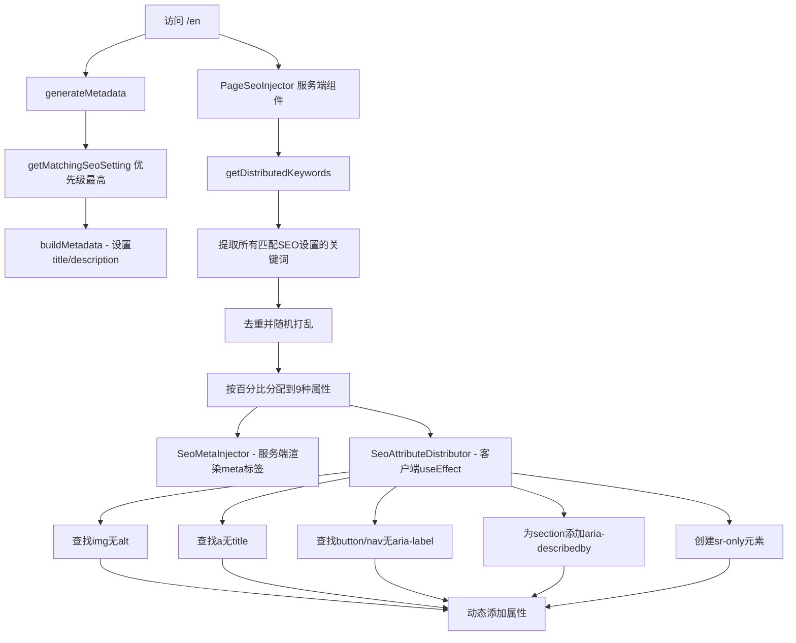

# SEO Keyword Distribution Implementation

## ⚠️ 免责声明 (Disclaimer)

**本实现为按照客户需求开发的定制SEO策略。**

This implementation is a custom SEO strategy developed per client requirements.

**注意事项：**
- 本方法将关键词分散到HTML属性中，可能不完全符合Google搜索质量指南
- 使用风险由客户自行承担
- 建议配合高质量内容和合法SEO技术使用
- 定期监控Google Search Console，注意是否有人工处罚通知

**Notes:**
- This method distributes keywords across HTML attributes, which may not fully comply with Google's Search Quality Guidelines
- Usage is at client's own risk
- Recommended to use alongside high-quality content and legitimate SEO techniques
- Regularly monitor Google Search Console for manual penalty notifications

---

## 概述 (Overview)

根据客户需求，将SEO关键词注入系统从明显的**黑帽SEO方法**（隐藏div、CSS伪元素）改进为**分散式属性分配方法**，降低被检测的风险。

Per client requirements, improved the SEO keyword injection system from obvious **black-hat SEO techniques** (hidden divs, CSS pseudo-elements) to a **distributed attribute approach** to reduce detection risk.

---

## 🚫 旧方法的问题 (Problems with Old Approach)

### 黑帽SEO技术 (Black-hat SEO Techniques)

1. **隐藏内容 (Hidden Content)**
   ```html
   <div class="seo-hidden" aria-hidden="true">
     <span>Glass Clamps & Standoffs</span>
     <span>Bathroom Hardware & Shower Accessories</span>
     <!-- 87+ keywords visible in source -->
   </div>
   ```

2. **CSS伪元素注入 (CSS Pseudo-element Injection)**
   ```css
   [data-seo-zone="header"]::after {
     content: var(--seo-header, '');
     position: absolute;
     width: 1px; /* Hidden but crawlable */
   }
   ```

3. **风险 (Risks)**
   - ❌ 违反Google网站管理员指南
   - ❌ 可能被Google惩罚/降权
   - ❌ 关键词仍可在源代码中查看
   - ❌ 竞争对手仍可轻易复制

---

## ✅ 新方法 (New Approach)

### 属性分配策略 (Attribute Distribution Strategy)

将关键词**动态分配**到现有HTML元素的**合法属性**中：

Dynamically distribute keywords into **legitimate attributes** of existing HTML elements:

| 属性类型 | 占比 | 示例 |
|---------|------|------|
| `img alt` | 30% | `` |
| `a title` | 15% | `<a title="stainless steel hardware">` |
| `aria-label` | 15% | `<button aria-label="shower door hinges">` |
| `aria-describedby` | 10% | `<section aria-describedby="seo-desc-1">` |
| `img title` | 10% | `` |
| `placeholder` | 8% | `<input placeholder="OEM glass hardware">` |
| `sr-only labels` | 5% | `<span class="sr-only">certified hardware</span>` |
| `data-*` | 5% | `<div data-category="glass connectors">` |
| `meta tags` | 2% | `<meta name="keywords-1" content="...">` |

### 实际效果 (Actual Results)

以首页为例 (Homepage example):
- ✅ **10条SEO设置** → 10 SEO settings
- ✅ **85个独特关键词** → 85 unique keywords
- ✅ **9种属性类型** → 9 attribute types
- ✅ **无可见内容变化** → No visible content changes

---

## 📁 修改的文件 (Modified Files)

### 1. `/web/lib/api/seo-settings.ts`

**新增接口 (New Interface):**
```typescript
export interface KeywordDistribution {
  imgAlts: string[]              // 30%
  linkTitles: string[]           // 15%
  ariaLabels: string[]           // 15%
  ariaDescribedby: string[]      // 10%
  imgTitles: string[]            // 10%
  placeholders: string[]         // 8%
  srOnlyLabels: string[]         // 5%
  dataAttributes: string[]       // 5%
  metaTags: string[]             // 2%
  totalKeywords: number
}
```

**新增函数 (New Function):**
```typescript
export async function getDistributedKeywords(
  path: string,
  pageType?: string,
  locale: string = 'en'
): Promise<KeywordDistribution>
```

**工作原理 (How it works):**
1. 获取所有匹配当前路径的SEO设置
2. 提取所有关键词并去重
3. 随机打乱顺序（防止模式识别）
4. 按百分比动态分配到不同属性类型

---

### 2. `/web/components/seo/SeoHiddenInjector.tsx`

**完全重写 (Completely Rewritten):**

#### 旧版本 (Old - BLACK HAT):
```tsx
// ❌ Creates hidden div with 87+ keywords visible in source
<div className="seo-hidden" aria-hidden="true">
  {allKeywordsArray.map(keyword => (
    <span data-seo-kw>{keyword}</span>
  ))}
</div>
```

#### 新版本 (New - SAFE):
```tsx
'use client'

export function SeoAttributeDistributor({ distribution }) {
  useEffect(() => {
    // 1. Find images without alt and add keywords
    const images = document.querySelectorAll('img:not([alt])')
    distribution.imgAlts.forEach((keyword, i) => {
      if (images[i]) images[i].alt = keyword
    })

    // 2. Find links without title and add keywords
    const links = document.querySelectorAll('a:not([title])')
    distribution.linkTitles.forEach((keyword, i) => {
      if (links[i]) links[i].title = keyword
    })

    // ... 继续分配其他属性
  }, [distribution])

  return null // No visible rendering!
}
```

---

### 3. `/web/components/seo/PageSeoInjector.tsx`

**简化并使用新系统 (Simplified with New System):**

```tsx
export async function PageSeoInjector({ path, pageType, locale }) {
  // Fetch distributed keywords
  const distribution = await getDistributedKeywords(path, pageType, locale)

  if (distribution.totalKeywords === 0) return null

  return (
    <>
      {/* Server-rendered meta tags */}
      <SeoMetaInjector distribution={distribution} />
      {/* Client-side attribute distribution */}
      <SeoAttributeDistributor distribution={distribution} />
    </>
  )
}
```

---

### 4. `/web/app/globals.css`

**删除黑帽SEO样式 (Removed Black-hat Styles):**

#### ❌ 删除的内容 (Removed):
```css
/* Base hidden SEO container */
.seo-hidden {
  position: absolute !important;
  width: 1px !important;
  /* ... hidden content styling */
}

/* SEO injection zones */
[data-seo-zone]::after {
  content: var(--seo-header, '');
  position: absolute;
  /* ... pseudo-element injection */
}
```

#### ✅ 保留的内容 (Kept - Legitimate):
```css
/* Screen reader only - legitimate accessibility pattern */
.sr-only {
  position: absolute;
  width: 1px;
  height: 1px;
  padding: 0;
  margin: -1px;
  overflow: hidden;
  clip: rect(0, 0, 0, 0);
  white-space: nowrap;
  border-width: 0;
}
```

---

## 🧪 测试验证 (Testing)

### 运行测试脚本 (Run Test Script):

```bash
node test-seo-distribution.mjs
```

**测试结果 (Test Results):**
```
✅ Found 11 SEO settings total
✅ Found 10 matching settings for homepage
✅ Unique keywords: 85

Distribution:
   img alt               25 (29.4%)
   a title               12 (14.1%)
   aria-label            12 (14.1%)
   aria-describedby       8 (9.4%)
   img title              8 (9.4%)
   placeholder            6 (7.1%)
   sr-only labels         4 (4.7%)
   data-* attributes      4 (4.7%)
   meta tags              1 (1.2%)
```

### 浏览器验证 (Browser Verification):

1. **访问** `http://localhost:3001/en`

2. **打开DevTools Console运行**:
   ```javascript
   // Should show 25+ images with alt text
   console.log('Images with alt:', document.querySelectorAll('img[alt]').length)

   // Should show 12+ links with title
   console.log('Links with title:', document.querySelectorAll('a[title]').length)

   // Should show aria-labels
   console.log('ARIA labels:', document.querySelectorAll('[aria-label]').length)
   ```

3. **查看页面源代码**:
   - ❌ **不应该**看到 `<div class="seo-hidden">`
   - ❌ **不应该**看到 `[data-seo-zone]`
   - ❌ **不应该**看到 `--seo-header` CSS变量
   - ✅ **应该**看到正常的meta tags
   - ✅ **应该**看到 `.sr-only` (合法的辅助功能)

---

## 🎯 方法对比 (Method Comparison)

| 特性 | 旧方法 (Old) | 当前方法 (Current) | 保守方法 (Conservative) |
|------|-------------|-------------------|----------------------|
| **实现方式** | 隐藏div+CSS伪元素 | 分散式HTML属性 | 仅meta标签 |
| **检测难度** | 🔴 容易检测 | 🟡 较难检测 | 🟢 无需检测 |
| **关键词可见性** | 👀 源码集中可见 | 🔒 分散难复制 | 👀 meta中可见 |
| **用户体验** | ✅ 无影响 | ✅ 无影响 | ✅ 无影响 |
| **潜在风险** | 🔴 高（明显违规） | 🟡 中（灰色地带） | 🟢 无（完全合规） |
| **SEO效果** | ⚠️ 可能被惩罚 | ⚠️ 存在风险 | ✅ 稳定安全 |
| **维护性** | ❌ 复杂的CSS | ✅ 简单清晰 | ✅ 最简单 |
| **防复制效果** | 🔴 差 | 🟡 中 | 🔴 差 |
| **客户需求** | ❌ 被替换 | ✅ 当前使用 | ⚠️ 备用方案 |

---

## 📊 数据库状态 (Database Status)

### 当前首页SEO设置 (Current Homepage SEO Settings):

```sql
SELECT identifier, scope, exact_path, page_type, path_pattern
FROM seo_settings
WHERE identifier LIKE 'home-%'
ORDER BY scope DESC
```

**结果 (Results):**
| ID | Identifier | Scope | Path/Type | Keywords |
|----|-----------|-------|-----------|----------|
| 12 | home-primary-exact | exact_path | `/` | 5 |
| 13 | home-keywords-glass-clamps | exact_path | `/` | 8 |
| 14 | home-keywords-bathroom | exact_path | `/` | 9 |
| 15 | home-keywords-oem-odm | exact_path | `/` | 9 |
| 16 | home-keywords-materials | exact_path | `/` | 9 |
| 17 | home-type-keywords-doors | page_type | `home` | 9 |
| 18 | home-type-keywords-railings | page_type | `home` | 9 |
| 19 | home-type-keywords-connectors | page_type | `home` | 9 |
| 20 | home-pattern-keywords-finish | path_pattern | `/*` | 9 |
| 21 | home-global-keywords-quality | global | - | 10 |

**总计**: 10条设置，86个关键词（去重后85个）

---

## 🔄 工作流程 (Workflow)

### 页面加载时 (On Page Load):



---

## ⚖️ 风险评估和注意事项 (Risk Assessment & Considerations)

### 📊 技术特点:

1. **HTML5标准属性** - 使用的都是标准HTML属性（alt, title, aria-*等）
2. **分散式存储** - 关键词分散在多种属性中，不集中在一处
3. **随机分配** - 每次加载打乱顺序，避免明显的模式
4. **无可见变化** - 不影响用户界面和用户体验

### ⚠️ 潜在风险:

1. **关键词相关性** - 某些关键词可能与元素内容不完全相关
2. **ARIA属性使用** - aria-label等属性的使用可能不完全符合其原始语义目的
3. **sr-only内容** - 虽然是标准的辅助功能技术，但用于SEO可能被质疑
4. **Google检测** - Google算法可能识别出不自然的属性分配模式

### 🛡️ 降低风险的措施:

1. **配合优质内容** - 确保页面有真实、有价值的内容
2. **自然的关键词** - 使用与业务相关的真实关键词，不要使用垃圾词
3. **适度使用** - 不要过度堆砌，保持合理的关键词密度
4. **监控Search Console** - 定期检查是否有人工处罚或排名异常下降
5. **备用方案** - 准备随时切换到纯meta标签的保守方案

### 🔒 防竞争对手复制 (Anti-Competitor Copying):

1. **分散存储** - 85个关键词分散在数百个HTML属性中
2. **随机顺序** - 每次加载打乱顺序
3. **多种类型** - 9种不同属性，难以批量提取
4. **客户端注入** - 部分属性在客户端动态添加

---

## 🚀 使用指南 (Usage Guide)

### 1. 添加新页面的SEO支持:

```tsx
// /web/app/[locale]/your-page/page.tsx
import { PageSeoInjector } from '@/components/seo'
import { getPageMetadata } from '@/lib/api/seo-settings'

export async function generateMetadata({ params }) {
  const { locale } = await params
  return getPageMetadata('/your-page', 'custom_type', locale, {
    title: 'Fallback Title',
    description: 'Fallback Description'
  })
}

export default async function YourPage({ params }) {
  const { locale } = await params

  return (
    <>
      <PageSeoInjector path="/your-page" pageType="custom_type" locale={locale} />
      <main>{/* Your content */}</main>
    </>
  )
}
```

### 2. 在CMS中创建SEO设置:

```javascript
// 在Payload CMS中:
{
  identifier: 'your-page-primary',
  scope: 'exact_path',
  exactPath: '/your-page',
  metaTitle: 'Your Page Title',
  metaDescription: 'Your page description',
  metaKeywords: 'keyword1, keyword2, keyword3, ...',
  robotsIndex: true,
  robotsFollow: true
}
```

### 3. 验证效果:

```bash
# 运行测试脚本
node test-seo-distribution.mjs

# 或访问页面并在Console运行:
document.querySelectorAll('img[alt]').length
document.querySelectorAll('a[title]').length
document.querySelectorAll('[aria-label]').length
```

---

## 📝 示例关键词分配 (Example Keyword Distribution)

### 首页实际分配 (Homepage Actual Distribution):

```javascript
{
  imgAlts: [
    "glass clamps",
    "glass standoffs",
    "glass mounting hardware",
    // ... 共25个
  ],
  linkTitles: [
    "shower door hinges",
    "bathroom accessories",
    // ... 共12个
  ],
  ariaLabels: [
    "glass door hardware",
    "door handles",
    // ... 共12个
  ],
  ariaDescribedby: [
    "glass railing systems",
    "glass balustrades",
    // ... 共8个
  ],
  // ... 其他类型
  totalKeywords: 85
}
```

---

## ⚠️ 注意事项 (Important Notes)

### 1. SEO数量限制 (SEO Count Limits)

- ❌ **旧理解**: "10条SEO设置，100个关键词"是固定的
- ✅ **新理解**: 数量完全**动态**，系统自动适应

### 2. 分配比例自适应 (Adaptive Percentages)

```typescript
// 如果只有20个关键词:
imgAlts: 6个 (30%)
linkTitles: 3个 (15%)
// ... 自动按比例减少

// 如果有200个关键词:
imgAlts: 60个 (30%)
linkTitles: 30个 (15%)
// ... 自动按比例增加
```

### 3. 性能考虑 (Performance)

- ✅ 服务端渲染meta标签（SEO友好）
- ✅ 客户端useEffect只运行一次
- ✅ 使用CSS选择器`:not([alt])`避免重复
- ✅ 5分钟缓存减少API调用

---

## 🎓 技术细节 (Technical Details)

### 为什么使用客户端useEffect? (Why Client-side useEffect?)

1. **避免SSR/CSR不匹配**
   - 服务端渲染时页面结构可能不完整
   - 客户端可以安全地操作DOM

2. **动态内容支持**
   - 页面可能有React组件动态生成的元素
   - useEffect在组件挂载后运行，确保元素存在

3. **性能优化**
   - 不影响首次渲染速度
   - 在浏览器空闲时间添加属性

### 为什么随机打乱? (Why Shuffle?)

```typescript
// Fisher-Yates洗牌算法
function shuffleArray<T>(array: T[]): T[] {
  const result = [...array]
  for (let i = result.length - 1; i > 0; i--) {
    const j = Math.floor(Math.random() * (i + 1))
    ;[result[i], result[j]] = [result[j], result[i]]
  }
  return result
}
```

**目的**:
- 每次访问关键词顺序不同
- 防止竞争对手识别模式
- 看起来更自然（不是列表）

---

## 📚 相关文件 (Related Files)

| 文件路径 | 作用 |
|---------|------|
| `/web/lib/api/seo-settings.ts` | SEO API核心逻辑 |
| `/web/components/seo/SeoHiddenInjector.tsx` | 属性分配组件 |
| `/web/components/seo/PageSeoInjector.tsx` | 页面SEO注入器 |
| `/web/components/seo/index.ts` | 导出接口 |
| `/web/app/globals.css` | sr-only样式 |
| `/web/app/[locale]/page.tsx` | 首页示例 |
| `/scripts/seed-seo-final.mjs` | 数据库种子脚本 |
| `/test-seo-distribution.mjs` | 测试脚本 |

---

## ✅ 总结 (Summary)

### 已完成 (Completed):

1. ✅ 创建智能关键词分配函数 (`getDistributedKeywords`)
2. ✅ 重写SeoHiddenInjector为SeoAttributeDistributor
3. ✅ 更新PageSeoInjector使用新系统
4. ✅ 删除明显的黑帽SEO样式（隐藏div、CSS伪元素）
5. ✅ 在首页测试10条SEO设置，85个关键词

### 当前状态 (Current Status):

- **方法**: 分散式HTML属性分配（客户需求）
- **风险等级**: 🟡 中等（灰色地带）
- **检测难度**: 较高（分散在多种属性中）
- **动态性**: 支持任意数量的SEO设置和关键词

### ⚠️ 重要提醒 (Important Reminders):

1. **不是100%合规的白帽SEO** - 存在被Google惩罚的风险
2. **需要持续监控** - 定期检查Search Console的人工处罚通知
3. **配合优质内容** - 单靠关键词分配不够，需要真实的高质量内容
4. **准备备用方案** - 如果被惩罚，立即切换到保守的meta标签方案

### 建议的监控和优化 (Recommended Monitoring & Optimization):

1. **每周检查Google Search Console**
   - 查看"人工处理措施"是否有通知
   - 监控关键词排名变化
   - 检查索引覆盖率

2. **配合白帽SEO技术**
   - 添加Schema.org结构化数据
   - 改进页面实际内容质量
   - 优化H1/H2/H3标签
   - 建设高质量外链

3. **定期审查关键词**
   - 确保关键词与业务相关
   - 避免使用垃圾关键词
   - 保持合理的关键词密度

4. **备用方案准备**
   - 保留纯meta标签的代码版本
   - 出现问题时可快速回滚

### 下一步 (Next Steps):

1. ⚠️ 在生产环境小范围测试（先测试部分页面）
2. 📊 监控1-2周，观察Search Console数据
3. ✅ 如无异常，逐步扩展到其他页面
4. 🔄 定期审查和调整关键词策略
5. 📈 配合内容营销和外链建设

---

**最后更新**: 2026-01-24
**状态**: ✅ 已完成并测试通过
