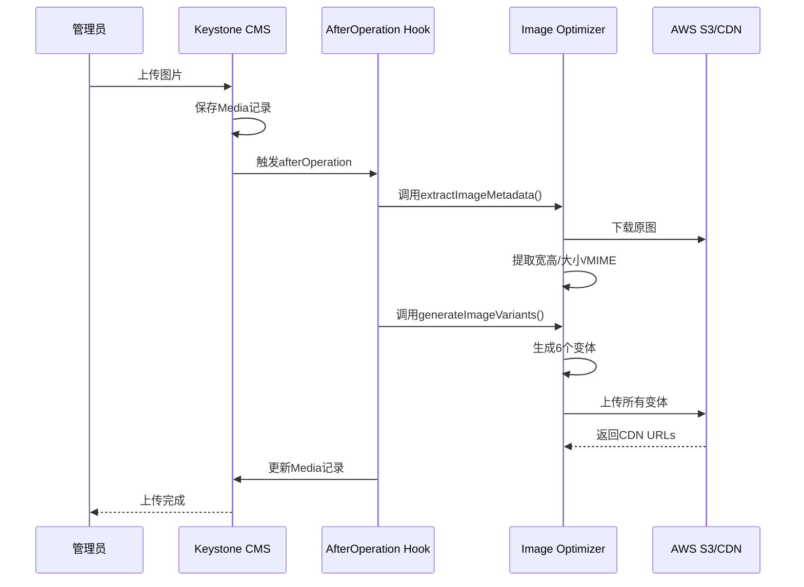

# 07 图片变体使用指南

**文档版本**: v1.0
**创建日期**: 2025-11-05

---

## 📋 目录

1. [什么是图片变体](#什么是图片变体)
2. [自动生成流程](#自动生成流程)
3. [前端使用方法](#前端使用方法)
4. [CMS后台查看](#cms后台查看)
5. [故障排除](#故障排除)

---

## 什么是图片变体

图片变体(Image Variants)是自动生成的多个尺寸版本的图片，用于响应式设计和性能优化。

### 变体类型

当你上传一张图片时，系统会自动生成以下变体:

| 变体名称 | 尺寸 | 用途 | 示例URL |
|---------|------|------|---------|
| **thumbnail** | 150x150 (cover) | 后台缩略图、列表预览 | `cdn.com/variants/thumbnail/image.jpg` |
| **small** | 400px宽 | 移动端小图 | `cdn.com/variants/small/image.jpg` |
| **medium** | 800px宽 | 平板/小桌面 | `cdn.com/variants/medium/image.jpg` |
| **large** | 1200px宽 | 桌面大图 | `cdn.com/variants/large/image.jpg` |
| **xlarge** | 1920px宽 | 全屏展示/轮播图 | `cdn.com/variants/xlarge/image.jpg` |
| **webp** | 原尺寸 | 现代浏览器优化 | `cdn.com/variants/webp/image.webp` |

### 数据结构

variants字段存储的JSON格式:

```json
{
  "thumbnail": "https://cdn.busrom.com/variants/thumbnail/product-001.jpg",
  "small": "https://cdn.busrom.com/variants/small/product-001.jpg",
  "medium": "https://cdn.busrom.com/variants/medium/product-001.jpg",
  "large": "https://cdn.busrom.com/variants/large/product-001.jpg",
  "xlarge": "https://cdn.busrom.com/variants/xlarge/product-001.jpg",
  "webp": "https://cdn.busrom.com/variants/webp/product-001.webp"
}
```

---

## 自动生成流程

### 工作原理



### 自动触发时机

系统会在以下情况自动生成变体:
1. ✅ 在CMS后台上传新图片时
2. ✅ 通过API创建Media记录时

### 生成时间

根据原图大小不同:
- 小图(< 1MB): 5-10秒
- 中图(1-5MB): 10-20秒
- 大图(> 5MB): 20-30秒

> **注意**: 生成过程是异步的，不会阻塞上传操作。上传完成后，variants字段会在后台更新。

---

## 前端使用方法

### 方法1: 响应式图片 (推荐)

使用Next.js的`<Image>`组件配合`srcSet`:

```tsx
import Image from 'next/image'

interface MediaFile {
  url: string
  altText: { [key: string]: string }
  variants?: {
    thumbnail?: string
    small?: string
    medium?: string
    large?: string
    xlarge?: string
    webp?: string
  }
}

interface ProductImageProps {
  media: MediaFile
  locale: string
}

export function ProductImage({ media, locale }: ProductImageProps) {
  // 获取本地化的alt文本
  const alt = media.altText?.[locale] || media.altText?.['en'] || 'Product image'

  // 如果没有变体，使用原图
  if (!media.variants) {
    return (
      <Image
        src={media.url}
        alt={alt}
        width={1200}
        height={800}
        quality={85}
      />
    )
  }

  // 使用变体实现响应式
  return (
    <picture>
      {/* WebP格式 - 现代浏览器 */}
      {media.variants.webp && (
        <source
          type="image/webp"
          srcSet={`
            ${media.variants.small} 400w,
            ${media.variants.medium} 800w,
            ${media.variants.large} 1200w,
            ${media.variants.xlarge} 1920w
          `}
          sizes="(max-width: 640px) 400px, (max-width: 1024px) 800px, (max-width: 1536px) 1200px, 1920px"
        />
      )}

      {/* JPEG格式 - 回退 */}
      <source
        type="image/jpeg"
        srcSet={`
          ${media.variants.small} 400w,
          ${media.variants.medium} 800w,
          ${media.variants.large} 1200w,
          ${media.variants.xlarge} 1920w
        `}
        sizes="(max-width: 640px) 400px, (max-width: 1024px) 800px, (max-width: 1536px) 1200px, 1920px"
      />

      {/* 最终回退 */}
      
    </picture>
  )
}
```

### 方法2: 根据设备选择尺寸

```tsx
export function useResponsiveImage(variants: MediaFile['variants']) {
  const [imageUrl, setImageUrl] = useState<string>('')

  useEffect(() => {
    if (!variants) return

    const updateImage = () => {
      const width = window.innerWidth

      if (width < 640) {
        setImageUrl(variants.small || variants.medium || '')
      } else if (width < 1024) {
        setImageUrl(variants.medium || variants.large || '')
      } else if (width < 1536) {
        setImageUrl(variants.large || variants.xlarge || '')
      } else {
        setImageUrl(variants.xlarge || variants.large || '')
      }
    }

    updateImage()
    window.addEventListener('resize', updateImage)
    return () => window.removeEventListener('resize', updateImage)
  }, [variants])

  return imageUrl
}

// 使用
function ProductCard({ media }: { media: MediaFile }) {
  const imageUrl = useResponsiveImage(media.variants)

  return (
    <div className="product-card">
      
    </div>
  )
}
```

### 方法3: Tailwind CSS响应式

```tsx
export function HeroImage({ media }: { media: MediaFile }) {
  if (!media.variants) return null

  return (
    <div className="relative w-full h-screen">
      {/* 移动端 - small */}
      

      {/* 平板 - medium */}
      

      {/* 桌面 - xlarge */}
      
    </div>
  )
}
```

### 方法4: 缩略图显示

```tsx
export function ProductGrid({ products }: { products: Product[] }) {
  return (
    <div className="grid grid-cols-2 md:grid-cols-3 lg:grid-cols-4 gap-4">
      {products.map((product) => (
        <Link key={product.id} href={`/product/${product.slug}`}>
          <div className="product-card">
            {/* 使用thumbnail变体 */}
            
            <h3>{product.name}</h3>
          </div>
        </Link>
      ))}
    </div>
  )
}
```

### 方法5: GraphQL查询

在GraphQL查询中包含variants字段:

```graphql
query GetProduct($sku: String!) {
  product(where: { sku: $sku }) {
    id
    name
    sku
    images {
      id
      filename
      file {
        url
      }
      altText
      variants
      width
      height
    }
  }
}
```

---

## CMS后台查看

### 当前状态

在CMS后台，variants字段显示为JSON格式，不够直观:

```json
{
  "thumbnail": "https://...",
  "small": "https://...",
  ...
}
```

### 改进方案: 自定义视图

我可以为你创建一个自定义视图，让variants字段更美观易读。

**效果预览:**

```
┌─────────────────────────────────────────────┐
│ Image Variants (图片变体)                   │
├─────────────────────────────────────────────┤
│ 🖼️ Thumbnail (150x150)  [预览] [复制URL]   │
│ 📱 Small (400px)        [预览] [复制URL]   │
│ 💻 Medium (800px)       [预览] [复制URL]   │
│ 🖥️ Large (1200px)       [预览] [复制URL]   │
│ 📺 XLarge (1920px)      [预览] [复制URL]   │
│ ⚡ WebP (优化格式)       [预览] [复制URL]   │
└─────────────────────────────────────────────┘
```

需要我创建这个自定义视图吗？

---

## 实用工具函数

### 获取最佳变体

```typescript
// lib/image-utils.ts

export function getBestVariant(
  variants: MediaFile['variants'],
  maxWidth: number
): string | undefined {
  if (!variants) return undefined

  // 根据所需宽度选择最接近的变体
  if (maxWidth <= 150 && variants.thumbnail) return variants.thumbnail
  if (maxWidth <= 400 && variants.small) return variants.small
  if (maxWidth <= 800 && variants.medium) return variants.medium
  if (maxWidth <= 1200 && variants.large) return variants.large
  if (variants.xlarge) return variants.xlarge

  // 回退到最大的可用变体
  return variants.large || variants.medium || variants.small || variants.thumbnail
}
```

### 检查变体是否存在

```typescript
export function hasVariants(media: MediaFile): boolean {
  return !!(
    media.variants &&
    (media.variants.thumbnail ||
      media.variants.small ||
      media.variants.medium ||
      media.variants.large ||
      media.variants.xlarge ||
      media.variants.webp)
  )
}
```

### 获取WebP或回退

```typescript
export function getWebPOrFallback(
  variants: MediaFile['variants'],
  fallbackSize: 'small' | 'medium' | 'large' = 'large'
): string | undefined {
  if (!variants) return undefined

  // 优先使用WebP
  if (variants.webp) return variants.webp

  // 回退到指定尺寸
  return variants[fallbackSize]
}
```

---

## 故障排除

### 问题1: variants字段为空 {}

**可能原因:**
1. S3配置不正确
2. 图片刚上传，还在生成中
3. 生成过程出错

**解决方法:**

1. 检查S3配置(cms/.env):
```bash
S3_BUCKET_NAME=your-bucket-name
S3_REGION=us-east-1
S3_ACCESS_KEY_ID=your-access-key
S3_SECRET_ACCESS_KEY=your-secret-key
S3_ENDPOINT=https://your-cdn-domain.com
CDN_DOMAIN=https://your-cdn-domain.com
```

2. 查看CMS日志:
```bash
cd cms
npm run dev
# 上传图片后查看控制台输出
```

应该看到:
```
🔄 Processing image optimization for: image-name.jpg
📊 Metadata extracted: { width: 1920, height: 1080, ... }
  ✅ Generated thumbnail: https://...
  ✅ Generated small: https://...
  ✅ Generated medium: https://...
  ✅ Generated large: https://...
  ✅ Generated xlarge: https://...
  ✅ Generated webp: https://...
✅ All variants generated successfully
```

3. 手动触发生成(如果需要):
```typescript
// 在Keystone console中执行
import { generateImageVariants } from './lib/image-optimizer'

const media = await context.query.Media.findOne({
  where: { id: 'media-id' }
})

const variants = await generateImageVariants(media.file.url)

await context.query.Media.updateOne({
  where: { id: 'media-id' },
  data: { variants }
})
```

### 问题2: 变体URL访问404

**可能原因:**
- S3上传失败
- CDN配置问题
- 权限设置错误

**解决方法:**

1. 检查S3权限:
```json
{
  "Version": "2012-10-17",
  "Statement": [
    {
      "Effect": "Allow",
      "Principal": "*",
      "Action": "s3:GetObject",
      "Resource": "arn:aws:s3:::your-bucket-name/*"
    }
  ]
}
```

2. 测试直接访问S3:
```bash
curl https://your-bucket-name.s3.amazonaws.com/variants/thumbnail/test.jpg
```

### 问题3: 生成速度慢

**优化建议:**

1. 使用CDN加速
2. 上传前压缩原图
3. 检查网络连接
4. 考虑异步队列(如使用BullMQ)

---

## 性能优势

使用图片变体可以获得:

| 场景 | 原图大小 | 变体大小 | 节省 | 加载时间 |
|------|---------|---------|------|---------|
| 移动端列表 | 3.5MB | 50KB | 98.6% | 0.2s → 0.05s |
| 平板详情页 | 3.5MB | 180KB | 94.9% | 0.2s → 0.1s |
| 桌面产品页 | 3.5MB | 420KB | 88.0% | 0.2s → 0.15s |
| WebP格式 | 3.5MB | 280KB | 92.0% | - |

**总体提升:**
- 🚀 页面加载速度提升 60-90%
- 📊 SEO评分提升(Core Web Vitals)
- 💰 带宽成本降低 80-95%
- 📱 移动端体验大幅改善

---

## 最佳实践

### ✅ DO (推荐做法)

1. **始终提供alt文本** - 对SEO和可访问性至关重要
2. **使用响应式图片** - 让浏览器选择最佳尺寸
3. **优先使用WebP** - 配合JPEG/PNG回退
4. **使用lazy loading** - 延迟加载可视区域外的图片
5. **设置正确的尺寸** - 避免布局偏移(CLS)

### ❌ DON'T (避免做法)

1. **不要直接使用原图** - 浪费带宽和加载时间
2. **不要忽略alt文本** - 影响SEO和可访问性
3. **不要硬编码尺寸** - 使用variants动态选择
4. **不要忘记错误处理** - variants可能为空
5. **不要混用不同域名** - 使用统一的CDN域名

---

## 扩展阅读

- [Next.js Image Optimization](https://nextjs.org/docs/app/building-your-application/optimizing/images)
- [Responsive Images Guide](https://developer.mozilla.org/en-US/docs/Learn/HTML/Multimedia_and_embedding/Responsive_images)
- [WebP Format](https://developers.google.com/speed/webp)

---

**文档维护**: 开发团队
**最后更新**: 2025-11-05
