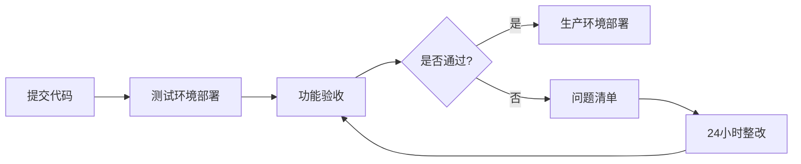

# 00 - Busrom 网站项目总览

> **阅读时间**: 5 分钟  
> **适用对象**: 项目经理、全体开发人员、设计师

---

## 🎯 项目目标

开发一个**国际化 B2B 玻璃五金产品展示网站**，实现以下核心目标：

| 目标 | 具体要求 | 验收标准 |
|------|---------|---------|
| **① 极速访问** | 页面加载时间 < 2 秒 | LCP < 2.5s (Core Web Vitals) |
| **② SEO 优化** | Google 首页排名 | 所有页面 Lighthouse SEO 分数 > 90 |
| **③ 响应式设计** | 适配所有设备 | 在 iPhone、iPad、Desktop 完美显示 |
| **④ 易维护** | 非技术人员可操作 | 运营可独立更新 80% 内容 |
| **⑤ 可追踪** | 支持埋点统计 | 支持 GA4、TikTok Pixel 等 |

---

## 🛠️ 技术栈

### 核心技术栈 (不可更改)

| 技术 | 版本 | 职责 |
|------|------|------|
| **Next.js** | `^15.6.0` | 前端框架 (必须使用 App Router) |
| **React** | `^19.1.0` | UI 库 |
| **Tailwind CSS** | `^3.4.17` | 样式系统 (禁用 Bootstrap) |
| **Keystone 6** | `^6.0.0` | 后端 CMS 框架 |
| **PostgreSQL** | `^15.0` | 主数据库 |
| **Prisma** | `^5.0.0` | ORM |
| **AWS S3** | - | 图片/媒体存储 |
| **Node.js** | `^24.11.0 LTS` | 运行环境 |

### 禁用技术

❌ **严禁使用以下技术**（验收时检查，违反需 24 小时整改）：

- PHP 及任何 PHP 模板引擎
- jQuery 及其插件
- Bootstrap、Foundation、Semantic UI 等 CSS 框架
- Vue、Angular 等其他前端框架

---

## 🌍 多语言支持

### 支持的语言范围

网站需支持 **24+ 种语言**，覆盖以下市场：

| 地区 | 主要语言 | 国家/地区数量 |
|------|---------|-------------|
| 北美 | English | 2 |
| 南美 | Spanish, Portuguese | 12 |
| 欧洲 | English, German, French, Italian, Dutch, etc. | 18 |
| 中东 | Arabic, Hebrew, Turkish, Persian | 13 |
| 非洲 | English, French, Arabic | 15 |
| 大洋洲 | English | 14 |

**默认语言**: `en` (English)  
**完整语言列表**: 参见前端 `languages.ts` 配置文件

### i18n 实现约定

1. **前端职责**: 语言检测、URL 重定向、语言切换 UI
2. **后端职责**: 提供多语言内容、支持 `?locale=xx` 参数
3. **数据结构**: 所有 API 返回**扁平化的单语言 JSON**，不返回嵌套的多语言对象

---

## 📐 网站结构

```
busrom.com/
├── [locale]/                    # 动态语言路径 (en, zh, es, ...)
│   ├── (首页)
│   ├── product/                 # 产品系列总览
│   │   └── [series]/            # 系列详情 (如 glass-standoff)
│   ├── shop/                    # 产品列表 (SKU 级别)
│   │   └── [sku]/               # 产品详情
│   ├── service/
│   │   ├── (服务概览)
│   │   ├── one-stop-shop/       # 一站式服务
│   │   ├── faq/                 # 常见问题
│   │   └── application/         # 应用案例
│   │       └── [slug]/          # 案例详情
│   ├── about-us/
│   │   ├── story/               # 我们的故事
│   │   ├── blog/                # 博客
│   │   │   └── [slug]/
│   │   └── support/             # 支持
│   ├── privacy-policy/          # 隐私政策
│   ├── fraud-notice/            # 欺诈提醒
│   └── contact-us/              # 联系我们
```

---

## 🎨 设计规范

### 配色方案

**莫兰迪暖风配色**（具体色值由设计师提供）

### 设计自由度

在**功能完整性**前提下，设计团队可自由发挥：

✅ **允许自由设计的方面**:
- 页面排版和布局
- UI 组件样式
- 交互动画效果
- 图标和插画风格

❌ **不可更改的方面**:
- 页面功能结构
- 导航菜单层级
- 表单字段定义
- SEO 技术实现

### 设计质量标准

1. **现代感**: 符合 2025 年国际 B2B 网站设计趋势
2. **专业性**: 体现品牌高端定位
3. **简约性**: 避免过度装饰，信息层级清晰
4. **动效**: 必须包含合理的交互动画，避免完全静态

---

## 🔒 安全与合规

### IP 访问控制

- **中国大陆 IP**: 返回 `403 Forbidden`
- **实现层**: Cloudflare Workers / CDN 层
- **白名单**: 预留管理员白名单功能

### 数据安全

- 表单输入需进行 **XSS 防护**
- 自定义代码注入功能需进行**危险代码检测**
- 用户密码需使用 **bcrypt** 加密存储

### GDPR 合规

- 隐私政策页面必须包含数据收集说明
- Cookie 使用需征得用户同意

---

## 📦 交付标准

### 交付内容清单

- [ ] **前端代码** (Next.js 项目)
- [ ] **后端代码** (Keystone 6 项目)
- [ ] **数据库 Schema** (Prisma migrations)
- [ ] **运营操作手册** (含截图)
- [ ] **技术文档** (API 文档、部署文档)
- [ ] **SEO 验收报告** (含截图)

### SEO 验收项

开发团队需提供以下**截图或演示**:

1. ✅ 所有页面的 `<meta>` 标签结构
2. ✅ `sitemap.xml` 自动生成功能
3. ✅ `robots.txt` 配置
4. ✅ 图片 `alt` 属性覆盖率 100%
5. ✅ SSR 页面源代码 (View Source 可见完整 HTML)
6. ✅ Lighthouse 报告 (Performance > 90, SEO > 95)

### 验收流程



---

## 🤝 协作模式

### 沟通渠道

- **日常沟通**: [指定沟通工具]
- **问题追踪**: [指定项目管理工具]
- **代码审查**: GitHub Pull Request

### 迭代周期

- **Sprint 周期**: 2 周
- **进度汇报**: 每周一、周五
- **演示验收**: 每个 Sprint 结束时

---

## 📖 相关文档索引

| 文档 | 对象 | 链接 |
|------|------|------|
| **01 - 前端开发指南** | 前端开发 | `01-前端开发指南.md` |
| **02 - 后端 API 契约** | 后端开发 | `02-后端API契约.md` |
| **03 - CMS 数据模型** | 后端开发 | `03-CMS数据模型/README.md` |
| **04 - SEO 技术规范** | 全栈开发 | `04-SEO技术规范.md` |
| **05 - CDP 系统设计** | 后端开发 | `05-CDP系统设计.md` |
| **API 类型定义** | 全栈开发 | `api-contracts/` |
| **代码示例** | 全栈开发 | `examples/` |
| **Claude Prompts** | AI 辅助开发 | `claude-prompts/` |

---

## ⚠️ 重要提醒

1. **技术栈不可变更**: 任何技术栈变更需提前书面申请
2. **多语言必须支持**: 所有文本内容都需支持 24+ 种语言
3. **SEO 优先**: 所有开发决策需考虑 SEO 影响
4. **安全第一**: 任何用户输入都需验证和过滤

---

**文档版本**: v1.0  
**最后更新**: 2025-10-31
**维护者**: [pakholam]