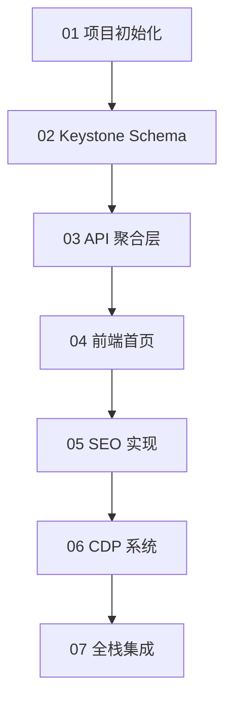

# Claude Code Prompt 模板集

本目录包含针对 Busrom 网站开发的所有 Claude Code Prompt 模板。

---

## 📁 目录结构

```
claude-prompts/
├── README.md                           # 本文件
├── 01-project-init.md                  # 项目初始化
├── 02-keystone-schemas.md              # Keystone Schema 开发
├── 03-nextjs-api-layer.md              # Next.js API 聚合层开发
├── 04-frontend-homepage.md             # 前端首页开发
├── 05-seo-implementation.md            # SEO 实现
├── 06-cdp-system.md                    # CDP 系统开发
└── 07-full-stack-integration.md        # 全栈集成测试
```

---

## 🎯 Prompt 使用流程



---

## 📋 Prompt 清单

### Phase 1: 后端基础 (Priority: P0)

| Prompt 文件 | 目标 | 预计时间 | 验收标准 |
|------------|------|---------|---------|
| **01-project-init.md** | 初始化项目结构 | 1-2 小时 | ✅ 项目可运行<br>✅ 依赖已安装 |
| **02-keystone-schemas.md** | 创建所有数据模型 | 4-6 小时 | ✅ CMS 可访问<br>✅ 数据库迁移成功 |

---

### Phase 2: API 聚合层 (Priority: P0)

| Prompt 文件 | 目标 | 预计时间 | 验收标准 |
|------------|------|---------|---------|
| **03-nextjs-api-layer.md** | 实现 RESTful API | 3-4 小时 | ✅ `/api/v1/home` 可访问<br>✅ 多语言查询正常 |

---

### Phase 3: 前端开发 (Priority: P0)

| Prompt 文件 | 目标 | 预计时间 | 验收标准 |
|------------|------|---------|---------|
| **04-frontend-homepage.md** | 开发首页 16 个区块 | 8-12 小时 | ✅ 所有区块已实现<br>✅ 响应式正常 |

---

### Phase 4: SEO 优化 (Priority: P1)

| Prompt 文件 | 目标 | 预计时间 | 验收标准 |
|------------|------|---------|---------|
| **05-seo-implementation.md** | 实现 SEO 功能 | 2-3 小时 | ✅ Lighthouse SEO > 95<br>✅ Sitemap 可访问 |

---

### Phase 5: CDP 系统 (Priority: P1)

| Prompt 文件 | 目标 | 预计时间 | 验收标准 |
|------------|------|---------|---------|
| **06-cdp-system.md** | 开发数据分析系统 | 6-8 小时 | ✅ 埋点正常工作<br>✅ 数据可视化大屏可访问 |

---

### Phase 6: 集成测试 (Priority: P2)

| Prompt 文件 | 目标 | 预计时间 | 验收标准 |
|------------|------|---------|---------|
| **07-full-stack-integration.md** | 全栈功能测试 | 2-4 小时 | ✅ 所有功能正常<br>✅ 无明显 Bug |

---

## 🚀 快速开始

### 步骤 1: 准备工作

1. **阅读完整文档**:
   - [00 - 项目总览](../00-项目总览.md)
   - [01 - 前端开发指南](../01-前端开发指南.md)
   - [02 - 后端 API 契约](../02-后端API契约.md)
   - [03 - CMS 数据模型](../03-CMS数据模型/README.md)

2. **准备环境**:
   ```bash
   # 安装 Node.js 20.x LTS
   node --version  # v20.x.x
   
   # 准备 PostgreSQL 数据库
   # 准备 AWS S3 凭证
   ```

---

### 步骤 2: 使用第一个 Prompt

```markdown
# 复制 01-project-init.md 的内容
# 粘贴到 Claude Code
# 按照 Prompt 中的指示开始工作
```

---

### 步骤 3: 逐步推进

按照 **01 → 02 → 03 → ... → 07** 的顺序，逐个完成 Prompt 任务。

每完成一个 Prompt：
- ✅ 运行验收测试
- ✅ 提交 Git Commit
- ✅ 记录遇到的问题

---

## 📖 Prompt 详细说明

### 01 - 项目初始化

**目标**: 搭建基础项目结构

**包含**:
- 创建 Next.js 项目（App Router）
- 创建 Keystone 项目
- 配置 TypeScript、Tailwind CSS
- 配置 ESLint、Prettier
- 配置 Git 仓库

**输出**:
```
busrom-project/
├── frontend/          # Next.js 项目
├── backend/           # Keystone 项目
├── .gitignore
└── README.md
```

---

### 02 - Keystone Schema 开发

**目标**: 创建所有数据模型

**包含**:
- `HomePage` 单例模型
- `Media` 媒体库（AWS S3 集成）
- `Product`, `ProductSeries` 产品模型
- `Blog`, `Application` 内容模型
- `Navigation`, `Category` 配置模型
- 多语言字段实现

**输出**:
- ✅ 所有 Schema 文件
- ✅ 数据库迁移文件
- ✅ CMS Admin UI 可访问

---

### 03 - API 聚合层开发

**目标**: 实现 GraphQL → RESTful 转换

**包含**:
- `/api/v1/home` 接口
- `/api/v1/product/*` 接口
- `/api/v1/shop/*` 接口
- 多语言查询逻辑
- 缓存策略（ISR）

**输出**:
- ✅ 所有 API Route Handler
- ✅ API 文档
- ✅ Postman Collection

---

### 04 - 前端首页开发

**目标**: 实现首页 16 个区块

**包含**:
- Hero Banner（9 个模板）
- 产品系列轮播
- 服务特点
- 3D 球体
- ... (共 16 个区块)

**输出**:
- ✅ 所有区块组件
- ✅ 响应式设计
- ✅ 数据对接完成

---

### 05 - SEO 实现

**目标**: 完成所有 SEO 功能

**包含**:
- `generateMetadata` 函数
- Sitemap.xml 自动生成
- Robots.txt 配置
- 结构化数据（JSON-LD）
- hreflang 标签

**输出**:
- ✅ Lighthouse SEO > 95
- ✅ 图片 Alt 覆盖率 100%
- ✅ 验收截图

---

### 06 - CDP 系统开发

**目标**: 实现数据分析系统

**包含**:
- 前端埋点 SDK
- 后端事件接收 API
- 数据库表（`TrafficRaw`, `TrafficSummary`）
- ETL 定时任务
- CMS 可视化大屏

**输出**:
- ✅ 埋点 SDK
- ✅ 数据正常存储
- ✅ 可视化大屏可访问

---

### 07 - 全栈集成测试

**目标**: 端到端功能测试

**包含**:
- 功能测试清单
- 性能测试（Lighthouse）
- 安全测试（XSS、CSRF）
- 多语言测试
- 响应式测试

**输出**:
- ✅ 测试报告
- ✅ Bug 修复清单

---

## 💡 Prompt 使用技巧

### 技巧 1: 提供完整上下文

```markdown
你好，我需要你帮我开发 Busrom 网站的 [具体模块]。

**项目背景**:
- 技术栈: Next.js 14 + Keystone 6 + PostgreSQL
- 需求文档: 请仔细阅读 `/docs/[相关文档].md`
- 代码示例: 请参考 `/examples/[相关示例].ts`

**你的任务**:
[具体任务列表]

**具体要求**:
[详细要求]

**验收标准**:
[明确的验收标准]

请开始工作。
```

---

### 技巧 2: 分阶段推进

❌ **错误做法**: 一次性让 Claude Code 完成所有功能

✅ **正确做法**: 将大任务拆分成多个小任务

```markdown
# Phase 1: 创建基础 Schema
请先创建 Product 模型的基础结构（不包含多语言）

# Phase 2: 添加多语言支持
在现有 Product 模型上添加 24+ 种语言的字段

# Phase 3: 添加关系
添加 Product 和 Category 的关联关系
```

---

### 技巧 3: 提供示例数据

```markdown
请参考以下 mock 数据结构创建 Schema:

\`\`\`json
{
  "name_en": "Glass Standoff",
  "name_zh": "玻璃支撑件",
  "sku": "GS-001",
  "mainImage": "https://s3.../image.jpg"
}
\`\`\`
```

---

### 技巧 4: 明确验收标准

```markdown
**验收标准**:
- [ ] Schema 文件已创建
- [ ] 数据库迁移成功
- [ ] CMS Admin UI 可以创建新产品
- [ ] 多语言字段可以正常编辑
- [ ] 代码包含详细注释
```

---

## 🐛 常见问题

### Q1: Claude Code 生成的代码有错误怎么办？

**A**: 提供错误信息和堆栈跟踪：

```markdown
运行代码时出现以下错误:

\`\`\`
Error: Cannot find module '@keystone-6/core'
\`\`\`

请帮我修复这个问题。
```

---

### Q2: 如何让 Claude Code 理解项目结构？

**A**: 在 Prompt 中提供目录树：

```markdown
当前项目结构:

\`\`\`
backend/
├── keystone/
│   ├── schemas/
│   │   ├── Product.ts
│   │   └── Media.ts
│   └── keystone.ts
└── package.json
\`\`\`

请在 `keystone/schemas/` 目录下创建新的 Blog.ts 文件。
```

---

### Q3: Claude Code 生成的代码风格不一致？

**A**: 在 Prompt 中明确代码风格要求：

```markdown
**代码风格要求**:
- 使用 2 空格缩进
- 使用单引号而不是双引号
- 函数名使用 camelCase
- 类名使用 PascalCase
- 每个函数必须有 JSDoc 注释
```

---

## 📚 相关文档

- [项目总览](../00-项目总览.md)
- [前端开发指南](../01-前端开发指南.md)
- [后端 API 契约](../02-后端API契约.md)
- [CMS 数据模型](../03-CMS数据模型/README.md)
- [SEO 技术规范](../04-SEO技术规范.md)
- [CDP 系统设计](../05-CDP系统设计.md)
- [代码示例集](../examples/README.md)

---

## 🤝 反馈与改进

如果你在使用 Prompt 过程中遇到问题或有改进建议：

1. 记录问题和改进点
2. 在项目 Issue 中提出
3. 或直接提交 Pull Request 更新 Prompt

---

**最后更新**: 2025-01-XX  
**维护者**: Busrom 开发团队